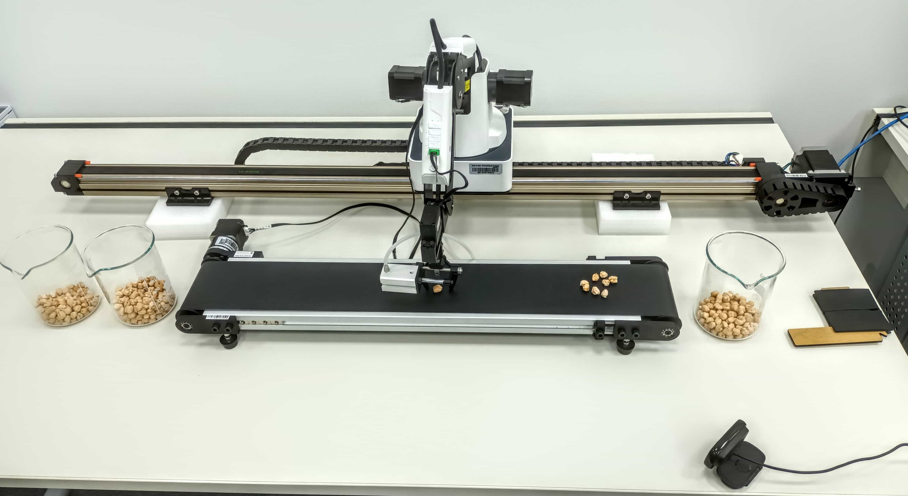
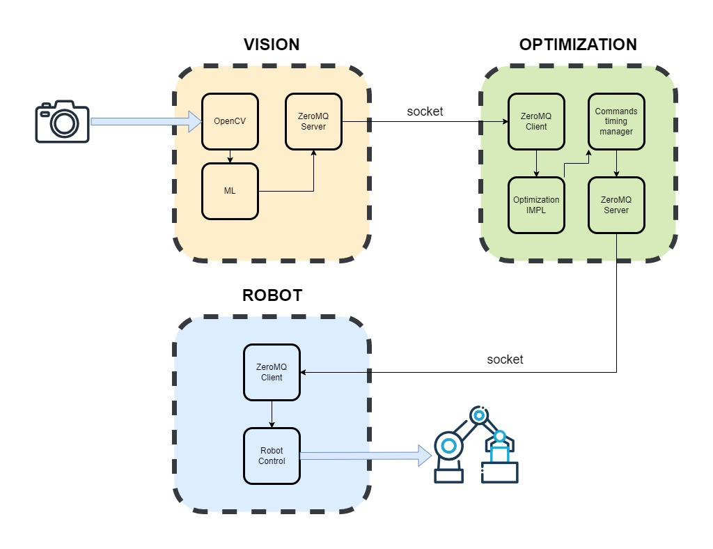

# Food Production chain Optimisation (Industry 4.0)

Optimization of the flow in a robotized food production chain.

System regrouping maching vision, optimization and robot control to optimizing the flow of items on a conveyor belt.

 

---

 

 

 <i> Robot arm with vision system </i> 

 

## 3 Parts System

### 1) Vision
- Image acquisition of 3 food/ingredients container.

- Processing of ingredients level (in pixels) within the 3 containers.

- Data communication server (socket) to exchange data between processes

### 2) Optimization
- Optimization of the robot positionning dependin (not only) of containers level and ingredients flow

- Timing of the command to be sent to the robot, provided by the optimization algorithm

- Data reception for vision and Serving to Robot control

### 3) Robot Control

- Robot control depending of the optimization commands

- Data reception process

 

 <i> System architecture </i> 

 

 

---

 

## Authors
- Dr. Brenno Castrillon Menezes
- Dr. Robert Eduard Franzoi Junior
- Shaymaa Fawzi M. Khalifa
- Maxime Clement

## Notable technologies used here
- OpenCV
- IMPL
- ZeroMQ
- FCN model
- Python