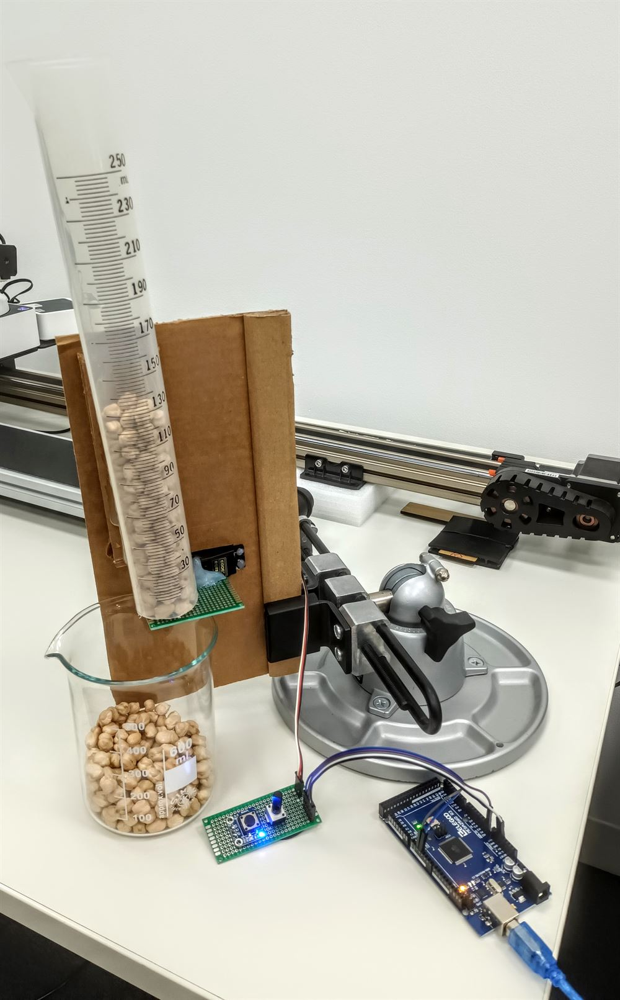

# Robotized Food Dispenser

Little robot that randomly dispense its content onto a conveyor belt (chickpeas here).

Made with arduino, the interval between serving can be adjusted via a potentiometer

 

 <i> Robot arm with vision system </i> 

 

 

---

 